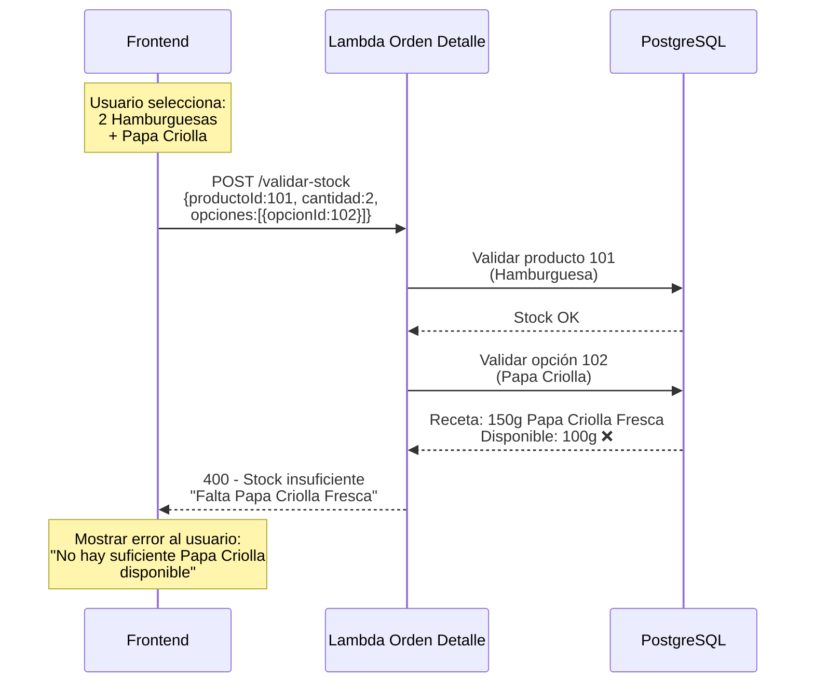

# Sistema de Opciones y Modificadores de Productos

## ⚠️ RETROCOMPATIBILIDAD GARANTIZADA

**Este sistema es 100% retrocompatible con la implementación actual.**

- ✅ Campos `opciones` y `modificadores` son **OPCIONALES**
- ✅ Si NO se envían, el sistema funciona **EXACTAMENTE IGUAL** que ahora
- ✅ Tablas nuevas NO afectan las existentes
- ✅ Frontend puede adoptar gradualmente las nuevas funcionalidades
- ✅ **CERO downtime** en el despliegue

---

## 📋 Tabla de Contenidos

1. [Problema a Resolver](#problema-a-resolver)
2. [Casos de Uso](#casos-de-uso)
3. [Arquitectura Propuesta](#arquitectura-propuesta)
4. [DDL - Tablas de Base de Datos](#ddl---tablas-de-base-de-datos)
5. [Lógica de Cálculo de Precios con Acompañamientos Incluidos](#-lógica-de-cálculo-de-precios-con-acompañamientos-incluidos)
6. [Servicios TypeScript](#servicios-typescript)
7. [Repository - Integración](#repository---integración)
8. [DTOs y Modelos](#dtos-y-modelos)
9. [Ejemplos de Configuración](#ejemplos-de-configuración)
10. [Flujo Completo de Pedido](#flujo-completo-de-pedido)
11. [Queries Útiles](#queries-útiles)
12. [Validación de Stock de Opciones (CRÍTICO)](#-validación-de-stock-de-opciones-crítico)
13. [Lambda de Administración (NUEVA)](#%EF%B8%8F-lambda-de-administración-nueva)
14. [Resumen de Implementación](#-resumen-de-implementación)
15. [Próximos Pasos](#-próximos-pasos)

---

## 🎯 Problema a Resolver

### **Escenario Real**

Un cliente llega al restaurante y hace un pedido con especificaciones:

> "Hamburguesa especial con papa criolla, sin cebolla y extra queso"

### **Desafíos**

1. ✅ **Opciones de acompañamiento**: El cliente puede elegir entre papa francesa, papa criolla o papa en cascos
2. ✅ **Impacto en inventario**: Cada tipo de papa consume insumos diferentes
3. ✅ **Modificadores**: "Sin cebolla", "Extra queso" deben registrarse
4. ✅ **Precio adicional**: Algunas opciones tienen costo extra
5. ✅ **Obligatoriedad**: Algunas elecciones son obligatorias, otras opcionales

---

## 📊 Casos de Uso

### **Caso 1: Opciones con Inventario**
- **Producto**: Hamburguesa
- **Grupo**: "Tipo de Papa" (obligatorio, elegir 1)
- **Opciones**:
  - Papa Francesa (+$0) → Consume insumo "Papa Congelada"
  - Papa Criolla (+$500) → Consume insumo "Papa Criolla Fresca"
  - Papa Cascos (+$1000) → Consume insumo "Papa Grande"

### **Caso 2: Opciones sin Inventario**
- **Producto**: Carne
- **Grupo**: "Término de Cocción" (obligatorio, elegir 1)
- **Opciones**:
  - Término Medio
  - Término Tres Cuartos
  - Bien Cocido

### **Caso 3: Modificadores Libres**
- Sin cebolla
- Sin tomate
- Extra queso (+$2000)
- Extra tocineta (+$3000)

### **Caso 4: Múltiples Opciones**
- **Producto**: Desayuno
- **Grupo 1**: "Tipo de Huevo" (obligatorio, elegir 1)
- **Grupo 2**: "Bebida" (obligatorio, elegir 1)
- **Grupo 3**: "Extras" (opcional, elegir hasta 3)

---

## 🏗️ Arquitectura Propuesta

### **Diagrama de Relaciones**

```
producto
    │
    ├─── producto_receta (receta base del producto)
    │       └─── insumo
    │
    └─── producto_grupo_opcion (grupos de opciones)
            │
            └─── producto_opcion (opciones disponibles)
                    │
                    └─── producto_opcion_receta (insumos que consume la opción)
                            └─── insumo

orden_detalle
    │
    ├─── orden_detalle_opcion (opciones seleccionadas)
    │       └─── producto_opcion
    │
    └─── orden_detalle_modificador (modificaciones libres)
```

### **Principios de Diseño**

1. ✅ **Reutilización**: Las opciones usan la misma estructura de recetas que los productos
2. ✅ **Consistencia**: Se usa el mismo `InventarioService` para reservar/liberar stock
3. ✅ **Transaccionalidad**: Todo en BEGIN/COMMIT/ROLLBACK
4. ✅ **Multitenant**: `cliente_id` en todas las tablas
5. ✅ **Snapshot**: Guardar nombres de opciones para historial

---

## 💾 DDL - Tablas de Base de Datos

### **1. Tabla: `producto_grupo_opcion`**

Define grupos de opciones asociadas a un producto.

```sql
-- =====================================================
-- GRUPOS DE OPCIONES
-- =====================================================
-- Ejemplo: "Tipo de Papa", "Bebida", "Tipo de Carne"
-- =====================================================

CREATE TABLE producto_grupo_opcion (
    grupo_opcion_id SERIAL PRIMARY KEY,
    cliente_id INT NOT NULL,
    producto_id INT NOT NULL,
    nombre VARCHAR(100) NOT NULL,           -- "Tipo de Papa", "Bebida"
    obligatorio BOOLEAN DEFAULT FALSE,      -- ¿El cliente DEBE elegir?
    minimo_selecciones INT DEFAULT 0,       -- Mínimo de opciones a elegir
    maximo_selecciones INT DEFAULT 1,       -- Máximo de opciones (1=radio, >1=checkbox)
    incluidos_en_precio INT DEFAULT 0,      -- ⭐ NUEVO: Cuántos van incluidos en el precio del producto
    cobrar_adicionales BOOLEAN DEFAULT TRUE, -- ⭐ NUEVO: Si se cobran las opciones que excedan incluidos_en_precio
    orden INT DEFAULT 0,                    -- Orden de presentación
    activo BOOLEAN DEFAULT TRUE,
    created_at TIMESTAMP DEFAULT NOW(),

    CONSTRAINT fk_grupo_opcion_cliente
        FOREIGN KEY (cliente_id) REFERENCES cliente(cliente_id)
        ON DELETE RESTRICT ON UPDATE RESTRICT,

    CONSTRAINT fk_grupo_opcion_producto
        FOREIGN KEY (producto_id) REFERENCES producto(producto_id)
        ON DELETE CASCADE ON UPDATE RESTRICT,

    CONSTRAINT uq_grupo_opcion
        UNIQUE (cliente_id, producto_id, nombre),

    CONSTRAINT chk_incluidos_no_negativo
        CHECK (incluidos_en_precio >= 0)
);

CREATE INDEX idx_grupo_opcion_producto ON producto_grupo_opcion
    USING btree (cliente_id, producto_id) WHERE activo = TRUE;

CREATE INDEX idx_grupo_opcion_orden ON producto_grupo_opcion
    USING btree (producto_id, orden) WHERE activo = TRUE;

COMMENT ON TABLE producto_grupo_opcion IS
'Grupos de opciones configurables para productos (ej: Tipo de Papa, Bebida)';

COMMENT ON COLUMN producto_grupo_opcion.obligatorio IS
'TRUE = el cliente debe elegir al menos una opción';

COMMENT ON COLUMN producto_grupo_opcion.maximo_selecciones IS
'1 = radio button (una sola opción), >1 = checkbox (múltiples opciones)';

COMMENT ON COLUMN producto_grupo_opcion.incluidos_en_precio IS
'⭐ CRÍTICO: Cuántas opciones van INCLUIDAS en el precio del producto. Ejemplo: Hamburguesa incluye 1 acompañamiento, si pide 2 acompañamientos solo cobra el segundo';

COMMENT ON COLUMN producto_grupo_opcion.cobrar_adicionales IS
'TRUE = cobrar las opciones que excedan incluidos_en_precio, FALSE = todas gratis';
```

---

### **2. Tabla: `producto_opcion`**

Define las opciones disponibles dentro de cada grupo.

```sql
-- =====================================================
-- OPCIONES DISPONIBLES
-- =====================================================
-- Ejemplo: "Papa Francesa", "Papa Criolla", "Papa Cascos"
-- =====================================================

CREATE TABLE producto_opcion (
    opcion_id SERIAL PRIMARY KEY,
    grupo_opcion_id INT NOT NULL,
    cliente_id INT NOT NULL,
    nombre VARCHAR(100) NOT NULL,           -- "Papa Francesa"
    precio_adicional NUMERIC(12,2) DEFAULT 0 NOT NULL,  -- Costo extra
    por_defecto BOOLEAN DEFAULT FALSE,      -- Opción seleccionada por defecto
    orden INT DEFAULT 0,                    -- Orden de presentación
    activo BOOLEAN DEFAULT TRUE,
    created_at TIMESTAMP DEFAULT NOW(),

    CONSTRAINT fk_opcion_grupo
        FOREIGN KEY (grupo_opcion_id)
        REFERENCES producto_grupo_opcion(grupo_opcion_id)
        ON DELETE CASCADE ON UPDATE RESTRICT,

    CONSTRAINT fk_opcion_cliente
        FOREIGN KEY (cliente_id) REFERENCES cliente(cliente_id)
        ON DELETE RESTRICT ON UPDATE RESTRICT,

    CONSTRAINT chk_precio_adicional_no_negativo
        CHECK (precio_adicional >= 0)
);

CREATE INDEX idx_opcion_grupo ON producto_opcion
    USING btree (grupo_opcion_id, orden) WHERE activo = TRUE;

CREATE INDEX idx_opcion_cliente ON producto_opcion
    USING btree (cliente_id) WHERE activo = TRUE;

CREATE INDEX idx_opcion_por_defecto ON producto_opcion
    USING btree (grupo_opcion_id) WHERE activo = TRUE AND por_defecto = TRUE;

COMMENT ON TABLE producto_opcion IS
'Opciones disponibles dentro de cada grupo (ej: Papa Francesa, Papa Criolla)';

COMMENT ON COLUMN producto_opcion.precio_adicional IS
'Costo adicional al precio base del producto';

COMMENT ON COLUMN producto_opcion.por_defecto IS
'TRUE = esta opción viene preseleccionada en el frontend';
```

---

### **3. Tabla: `producto_opcion_receta`**

Vincula cada opción con los insumos que consume (para gestión de inventario).

```sql
-- =====================================================
-- RECETA DE OPCIONES (Qué insumos consume cada opción)
-- =====================================================
-- REUTILIZA LA MISMA ESTRUCTURA QUE producto_receta
-- =====================================================

CREATE TABLE producto_opcion_receta (
    opcion_receta_id SERIAL PRIMARY KEY,
    cliente_id INT NOT NULL,
    opcion_id INT NOT NULL,
    insumo_id INT NOT NULL,
    cantidad_base NUMERIC(12,6) NOT NULL,   -- Cantidad del insumo por unidad
    merma_pct NUMERIC(5,2) DEFAULT 0 NOT NULL,  -- Porcentaje de merma
    activo BOOLEAN DEFAULT TRUE,
    created_at TIMESTAMP DEFAULT NOW(),

    CONSTRAINT fk_opcion_receta_opcion
        FOREIGN KEY (opcion_id)
        REFERENCES producto_opcion(opcion_id)
        ON DELETE CASCADE ON UPDATE RESTRICT,

    CONSTRAINT fk_opcion_receta_insumo
        FOREIGN KEY (insumo_id)
        REFERENCES insumo(insumo_id)
        ON DELETE RESTRICT ON UPDATE RESTRICT,

    CONSTRAINT fk_opcion_receta_cliente
        FOREIGN KEY (cliente_id) REFERENCES cliente(cliente_id)
        ON DELETE RESTRICT ON UPDATE RESTRICT,

    CONSTRAINT chk_cantidad_base_positiva
        CHECK (cantidad_base > 0),

    CONSTRAINT chk_merma_valida
        CHECK (merma_pct >= 0 AND merma_pct <= 100),

    CONSTRAINT uq_opcion_insumo
        UNIQUE (cliente_id, opcion_id, insumo_id)
);

CREATE INDEX idx_opcion_receta_opcion ON producto_opcion_receta
    USING btree (opcion_id, cliente_id) WHERE activo = TRUE;

CREATE INDEX idx_opcion_receta_insumo ON producto_opcion_receta
    USING btree (insumo_id, cliente_id) WHERE activo = TRUE;

COMMENT ON TABLE producto_opcion_receta IS
'Insumos que consume cada opción (ej: Papa Francesa consume 200g de Papa Congelada)';

COMMENT ON COLUMN producto_opcion_receta.cantidad_base IS
'Cantidad de insumo necesaria para preparar una unidad de la opción';

COMMENT ON COLUMN producto_opcion_receta.merma_pct IS
'Porcentaje de desperdicio/merma al preparar (ej: 5% = se reserva 5% extra)';
```

---

### **4. Tabla: `producto_modificador_predefinido`**

Define modificadores predefinidos para selección rápida del mesero (evita escribir texto libre).

```sql
-- =====================================================
-- MODIFICADORES PREDEFINIDOS (Para selección rápida)
-- =====================================================
-- Ejemplo: "Sin cebolla", "Extra queso", "Poco sal"
-- Permite al mesero seleccionar en lugar de escribir
-- =====================================================

CREATE TABLE producto_modificador_predefinido (
    modificador_id SERIAL PRIMARY KEY,
    cliente_id INT NOT NULL,
    producto_id INT,                        -- NULL = aplica a todos los productos
    tipo VARCHAR(20) NOT NULL,              -- 'SIN', 'EXTRA', 'MODIFICACION'
    nombre VARCHAR(100) NOT NULL,           -- "cebolla", "queso", "sal"
    descripcion VARCHAR(255),               -- "Sin cebolla", "Extra queso"
    precio_adicional NUMERIC(12,2) DEFAULT 0 NOT NULL,
    activo BOOLEAN DEFAULT TRUE,
    orden INT DEFAULT 0,                    -- Orden de presentación
    created_at TIMESTAMP DEFAULT NOW(),

    CONSTRAINT fk_modificador_cliente
        FOREIGN KEY (cliente_id) REFERENCES cliente(cliente_id)
        ON DELETE RESTRICT ON UPDATE RESTRICT,

    CONSTRAINT fk_modificador_producto
        FOREIGN KEY (producto_id) REFERENCES producto(producto_id)
        ON DELETE CASCADE ON UPDATE RESTRICT,

    CONSTRAINT chk_tipo_modificador_predefinido
        CHECK (tipo IN ('SIN', 'EXTRA', 'MODIFICACION')),

    CONSTRAINT chk_precio_modificador_no_negativo
        CHECK (precio_adicional >= 0)
);

CREATE INDEX idx_modificador_producto ON producto_modificador_predefinido
    USING btree (producto_id, cliente_id) WHERE activo = TRUE;

CREATE INDEX idx_modificador_global ON producto_modificador_predefinido
    USING btree (cliente_id) WHERE activo = TRUE AND producto_id IS NULL;

CREATE INDEX idx_modificador_tipo ON producto_modificador_predefinido
    USING btree (tipo, cliente_id) WHERE activo = TRUE;

COMMENT ON TABLE producto_modificador_predefinido IS
'Modificadores predefinidos para selección rápida del mesero. Evita escribir texto libre y asegura consistencia en precios y nombres.';

COMMENT ON COLUMN producto_modificador_predefinido.producto_id IS
'NULL = modificador global (aplica a todos los productos), NOT NULL = modificador específico de un producto';

COMMENT ON COLUMN producto_modificador_predefinido.nombre IS
'Nombre corto del modificador (ej: "cebolla", "queso")';

COMMENT ON COLUMN producto_modificador_predefinido.descripcion IS
'Descripción completa mostrada al usuario (ej: "Sin cebolla", "Extra queso")';
```

---

### **5. Tabla: `orden_detalle_opcion`**

Guarda las opciones seleccionadas por el cliente en cada pedido.

```sql
-- =====================================================
-- OPCIONES SELECCIONADAS EN CADA PEDIDO
-- =====================================================
-- Snapshot para mantener historial aunque se modifique configuración
-- =====================================================

CREATE TABLE orden_detalle_opcion (
    detalle_opcion_id SERIAL PRIMARY KEY,
    cliente_id INT NOT NULL,
    orden_detalle_id INT NOT NULL,
    grupo_opcion_id INT NOT NULL,
    opcion_id INT NOT NULL,
    nombre_grupo VARCHAR(100) NOT NULL,     -- Snapshot: "Tipo de Papa"
    nombre_opcion VARCHAR(100) NOT NULL,    -- Snapshot: "Papa Francesa"
    precio_adicional NUMERIC(12,2) DEFAULT 0 NOT NULL,
    created_at TIMESTAMP DEFAULT NOW(),

    CONSTRAINT fk_detalle_opcion_detalle
        FOREIGN KEY (orden_detalle_id)
        REFERENCES orden_detalle(orden_detalle_id)
        ON DELETE CASCADE ON UPDATE RESTRICT,

    CONSTRAINT fk_detalle_opcion_grupo
        FOREIGN KEY (grupo_opcion_id)
        REFERENCES producto_grupo_opcion(grupo_opcion_id)
        ON DELETE RESTRICT ON UPDATE RESTRICT,

    CONSTRAINT fk_detalle_opcion_opcion
        FOREIGN KEY (opcion_id)
        REFERENCES producto_opcion(opcion_id)
        ON DELETE RESTRICT ON UPDATE RESTRICT,

    CONSTRAINT fk_detalle_opcion_cliente
        FOREIGN KEY (cliente_id) REFERENCES cliente(cliente_id)
        ON DELETE RESTRICT ON UPDATE RESTRICT,

    CONSTRAINT chk_precio_adicional_opcion_no_negativo
        CHECK (precio_adicional >= 0)
);

CREATE INDEX idx_detalle_opcion_detalle ON orden_detalle_opcion
    USING btree (orden_detalle_id);

CREATE INDEX idx_detalle_opcion_cliente ON orden_detalle_opcion
    USING btree (cliente_id, orden_detalle_id);

CREATE INDEX idx_detalle_opcion_opcion ON orden_detalle_opcion
    USING btree (opcion_id);

COMMENT ON TABLE orden_detalle_opcion IS
'Opciones seleccionadas por el cliente en cada pedido (con snapshot de nombres)';

COMMENT ON COLUMN orden_detalle_opcion.nombre_grupo IS
'Snapshot del nombre del grupo en el momento del pedido';

COMMENT ON COLUMN orden_detalle_opcion.nombre_opcion IS
'Snapshot del nombre de la opción en el momento del pedido';
```

---

### **6. Tabla: `orden_detalle_modificador`**

Modificadores seleccionados en cada pedido (pueden ser predefinidos o texto libre).

```sql
-- =====================================================
-- MODIFICADORES SELECCIONADOS (Snapshot en pedido)
-- =====================================================
-- Soporta tanto modificadores predefinidos como texto libre
-- Guarda snapshot de nombres/precios
-- =====================================================

CREATE TABLE orden_detalle_modificador (
    detalle_modificador_id SERIAL PRIMARY KEY,
    cliente_id INT NOT NULL,
    orden_detalle_id INT NOT NULL,
    modificador_id INT,                     -- NULL = texto libre, NOT NULL = predefinido
    tipo VARCHAR(20) NOT NULL,              -- 'SIN', 'EXTRA', 'MODIFICACION'
    descripcion VARCHAR(255) NOT NULL,      -- Snapshot: "cebolla", "queso", "salsa picante"
    precio_adicional NUMERIC(12,2) DEFAULT 0 NOT NULL,
    created_at TIMESTAMP DEFAULT NOW(),

    CONSTRAINT fk_detalle_mod_detalle
        FOREIGN KEY (orden_detalle_id)
        REFERENCES orden_detalle(orden_detalle_id)
        ON DELETE CASCADE ON UPDATE RESTRICT,

    CONSTRAINT fk_detalle_mod_cliente
        FOREIGN KEY (cliente_id) REFERENCES cliente(cliente_id)
        ON DELETE RESTRICT ON UPDATE RESTRICT,

    CONSTRAINT fk_detalle_mod_modificador
        FOREIGN KEY (modificador_id)
        REFERENCES producto_modificador_predefinido(modificador_id)
        ON DELETE RESTRICT ON UPDATE RESTRICT,

    CONSTRAINT chk_tipo_modificador
        CHECK (tipo IN ('SIN', 'EXTRA', 'MODIFICACION')),

    CONSTRAINT chk_precio_adicional_mod_no_negativo
        CHECK (precio_adicional >= 0)
);

CREATE INDEX idx_detalle_mod_detalle ON orden_detalle_modificador
    USING btree (orden_detalle_id);

CREATE INDEX idx_detalle_mod_cliente ON orden_detalle_modificador
    USING btree (cliente_id, orden_detalle_id);

CREATE INDEX idx_detalle_mod_tipo ON orden_detalle_modificador
    USING btree (tipo);

CREATE INDEX idx_detalle_mod_modificador ON orden_detalle_modificador
    USING btree (modificador_id) WHERE modificador_id IS NOT NULL;

COMMENT ON TABLE orden_detalle_modificador IS
'Modificadores seleccionados en cada pedido (predefinidos o texto libre). Snapshot de nombres/precios para mantener historial.';

COMMENT ON COLUMN orden_detalle_modificador.modificador_id IS
'NULL = modificador de texto libre, NOT NULL = modificador predefinido (referencia a producto_modificador_predefinido)';

COMMENT ON COLUMN orden_detalle_modificador.tipo IS
'SIN = quitar ingrediente, EXTRA = agregar extra, MODIFICACION = cambio general';

COMMENT ON COLUMN orden_detalle_modificador.descripcion IS
'Snapshot de la descripción del modificador en el momento del pedido';
```

---

## 💰 Lógica de Cálculo de Precios con Acompañamientos Incluidos

### **Regla de Negocio CRÍTICA**

Muchos productos incluyen acompañamientos en su precio base. Por ejemplo:
- Hamburguesa ($15,000) **incluye 1 acompañamiento GRATIS**
- Si el cliente pide 1 acompañamiento → es TOTALMENTE GRATIS (sin importar cuál elija)
- Si el cliente pide 2 acompañamientos → el más CARO es gratis, el más barato SE COBRA

### **Configuración en `producto_grupo_opcion`**

```sql
-- Ejemplo: Hamburguesa incluye 1 acompañamiento
INSERT INTO producto_grupo_opcion
(cliente_id, producto_id, nombre, obligatorio, maximo_selecciones, incluidos_en_precio, cobrar_adicionales)
VALUES
(5, 101, 'Tipo de Papa', TRUE, 2, 1, TRUE);
--                                      ↑   ↑
--                           incluye 1 gratis, pero cobra los adicionales
```

| Campo | Valor | Significado |
|-------|-------|-------------|
| `maximo_selecciones` | 2 | Puede elegir hasta 2 acompañamientos |
| `incluidos_en_precio` | 1 | El primero va incluido en el precio |
| `cobrar_adicionales` | TRUE | Si pide más de 1, cobra los extras |

---

### **Algoritmo de Cálculo de Precio**

#### **Paso 1: Ordenar opciones seleccionadas por precio DESCENDENTE**

Esto garantiza que las más CARAS se usen como "incluidas" y las más baratas se cobren, dándole el mejor precio al cliente.

```typescript
// Ejemplo: Cliente seleccionó Papa Criolla ($500) y Papa Cascos ($1000)
const opcionesSeleccionadas = [
  { opcionId: 102, nombre: 'Papa Criolla', precioAdicional: 500 },
  { opcionId: 103, nombre: 'Papa Cascos', precioAdicional: 1000 }
];

// Ordenar por precio DESCENDENTE (más caras primero)
const opcionesOrdenadas = opcionesSeleccionadas.sort((a, b) =>
  b.precioAdicional - a.precioAdicional
);

// Resultado:
// [
//   { opcionId: 103, nombre: 'Papa Cascos', precioAdicional: 1000 },  ← Esta usa el slot GRATIS
//   { opcionId: 102, nombre: 'Papa Criolla', precioAdicional: 500 }   ← Esta se cobra
// ]
```

#### **Paso 2: Aplicar slots gratuitos a las más caras**

```typescript
const incluidosEnPrecio = 1;  // Hamburguesa incluye 1 acompañamiento
const cobrarAdicionales = true;

let totalOpciones = 0;

opcionesOrdenadas.forEach((opcion, index) => {
  if (index < incluidosEnPrecio) {
    // Esta opción usa un slot GRATIS → NO se cobra (ahorra al cliente)
    console.log(`${opcion.nombre}: GRATIS - slot incluido (ahorra $${opcion.precioAdicional})`);
    // NO sumamos nada
  } else if (cobrarAdicionales) {
    // Esta opción es adicional → SE COBRA COMPLETA
    totalOpciones += opcion.precioAdicional;
    console.log(`${opcion.nombre}: Se cobra $${opcion.precioAdicional}`);
  }
});

console.log(`Total adicional por opciones: $${totalOpciones}`);
```

---

### **Ejemplos Prácticos**

#### **Ejemplo 1: Cliente pide 1 acompañamiento (Papa Francesa)**

```
Configuración:
- incluidos_en_precio = 1
- cobrar_adicionales = TRUE

Opciones seleccionadas:
- Papa Francesa ($0)

Cálculo:
1. Ordenar: [Papa Francesa $0]
2. Índice 0 < 1 (incluido) → NO se cobra
3. Total adicional = $0

Precio final = $15,000 (precio base) + $0 = $15,000
```

#### **Ejemplo 2: Cliente pide 1 acompañamiento (Papa Criolla)**

```
Opciones seleccionadas:
- Papa Criolla ($500)

Cálculo:
1. Ordenar: [Papa Criolla $500]
2. Índice 0 < 1 (incluido) → Papa Criolla usa el slot GRATIS
3. Total adicional = $0

Precio final = $15,000 + $0 = $15,000
```

**✅ Nota importante**: El acompañamiento incluido es TOTALMENTE GRATIS, sin importar cuál elija el cliente (Papa Francesa o Papa Criolla).

#### **Ejemplo 3: Cliente pide 2 acompañamientos (Papa Francesa + Papa Criolla)**

```
Opciones seleccionadas:
- Papa Criolla ($500)
- Papa Francesa ($0)

Cálculo:
1. Ordenar DESCENDENTE: [Papa Criolla $500, Papa Francesa $0]
2. Índice 0 (Papa Criolla): Usa slot GRATIS → $0 (ahorra $500)
3. Índice 1 (Papa Francesa): Adicional → SE COBRA $0
4. Total adicional = $0

Precio final = $15,000 + $0 = $15,000
```

**Ventaja del algoritmo**: El cliente siempre recibe el mejor precio porque usamos la opción más CARA como incluida.

#### **Ejemplo 4: Cliente pide 2 acompañamientos (2x Papa Francesa)**

```
Opciones seleccionadas:
- Papa Francesa ($0)
- Papa Francesa ($0)

Cálculo:
1. Ordenar: [Papa Francesa $0, Papa Francesa $0]
2. Índice 0: Incluida → $0
3. Índice 1: Adicional → SE COBRA $0 (porque papa francesa no tiene precio adicional)
4. Total adicional = $0

Precio final = $15,000 + $0 = $15,000
```

#### **Ejemplo 5: Cliente pide 2 acompañamientos (Papa Criolla + Papa Cascos)**

```
Opciones seleccionadas:
- Papa Criolla ($500)
- Papa Cascos ($1000)

Cálculo:
1. Ordenar DESCENDENTE: [Papa Cascos $1000, Papa Criolla $500]
2. Índice 0 (Papa Cascos): Usa slot GRATIS → $0 (ahorra $1000)
3. Índice 1 (Papa Criolla): Adicional → SE COBRA $500
4. Total adicional = $500

Precio final = $15,000 + $500 = $15,500
```

**Beneficio**: El algoritmo usa Papa Cascos como incluida (ahorrando $1000) en lugar de Papa Criolla (ahorra $500). El cliente paga menos.

---

### **Implementación en TypeScript**

```typescript
/**
 * Calcula el precio adicional de opciones considerando las incluidas en el precio
 *
 * ALGORITMO:
 * 1. Ordenar por precio DESCENDENTE (más caras primero)
 * 2. Las primeras N opciones usan slots gratuitos (incluidos_en_precio)
 * 3. El resto se cobra completo
 *
 * Esto garantiza que el cliente siempre pague lo mínimo posible
 */
function calcularPrecioOpciones(
  opcionesSeleccionadas: { opcionId: number; precioAdicional: number }[],
  incluidosEnPrecio: number,
  cobrarAdicionales: boolean
): number {
  // 1. Ordenar opciones por precio DESCENDENTE (más caras primero)
  const opcionesOrdenadas = [...opcionesSeleccionadas].sort(
    (a, b) => b.precioAdicional - a.precioAdicional
  );

  // 2. Sumar solo las que excedan las incluidas
  let totalAdicional = 0;

  opcionesOrdenadas.forEach((opcion, index) => {
    if (index < incluidosEnPrecio) {
      // Esta opción usa un slot GRATIS → NO se cobra
      // (las más caras usan los slots gratuitos para minimizar el costo)
      // NO sumamos nada
    } else if (cobrarAdicionales) {
      // Esta opción es adicional y se debe cobrar COMPLETA
      totalAdicional += opcion.precioAdicional;
    }
    // Si !cobrarAdicionales, todas las adicionales son gratis
  });

  return totalAdicional;
}
```

**Uso:**
```typescript
const opciones = [
  { opcionId: 102, precioAdicional: 500 },  // Papa Criolla
  { opcionId: 103, precioAdicional: 1000 }  // Papa Cascos
];

const total = calcularPrecioOpciones(
  opciones,
  1,     // incluidos_en_precio
  true   // cobrar_adicionales
);

console.log(total);  // 500 (usó Papa Cascos como GRATIS, cobró Papa Criolla)
```

---

### **Actualización en `orden_detalle_opcion`**

Agregar campo para indicar si la opción se cobró o fue gratis:

```sql
ALTER TABLE orden_detalle_opcion
ADD COLUMN fue_gratuita BOOLEAN DEFAULT FALSE;

COMMENT ON COLUMN orden_detalle_opcion.fue_gratuita IS
'TRUE = esta opción usó un slot de "incluidos_en_precio" y no se cobró (snapshot)';
```

---

### **Query para calcular precio correcto en INSERT**

```sql
-- Al insertar opciones, calcular cuáles son gratuitas
WITH opciones_ordenadas AS (
  SELECT
    opcion_id,
    precio_adicional,
    ROW_NUMBER() OVER (ORDER BY precio_adicional DESC) as indice  -- DESCENDENTE
  FROM (VALUES
    (102, 500),   -- Papa Criolla
    (103, 1000)   -- Papa Cascos
  ) AS opciones(opcion_id, precio_adicional)
),
opciones_con_cobro AS (
  SELECT
    opcion_id,
    precio_adicional,
    CASE
      WHEN indice <= 1 THEN TRUE   -- incluidos_en_precio = 1
      ELSE FALSE
    END as fue_gratuita,
    CASE
      WHEN indice <= 1 THEN 0       -- Incluida = GRATIS
      ELSE precio_adicional         -- Adicional = precio completo
    END as precio_a_cobrar
  FROM opciones_ordenadas
)
SELECT * FROM opciones_con_cobro;
```

**Resultado:**
```
opcion_id | precio_adicional | fue_gratuita | precio_a_cobrar
----------|------------------|--------------|----------------
    103   |      1000        |     TRUE     |       0         (Papa Cascos GRATIS)
    102   |       500        |    FALSE     |      500        (Papa Criolla se cobra)
```

---

## 🔧 Servicios TypeScript

### **Extensión de `InventarioService.ts`**

Agregar los siguientes métodos al archivo existente `src/services/InventarioService.ts`:

```typescript
/**
 * ========================================================
 * RESERVAR INVENTARIO DE OPCIONES SELECCIONADAS
 * ========================================================
 * REUTILIZA la misma lógica de producto_receta
 * Cada opción puede tener su propia receta de insumos
 */
async reservarInventarioOpciones(
  clienteId: number,
  opciones: { opcionId: number; cantidad: number }[]
): Promise<void> {
  for (const item of opciones) {
    // 1. Obtener receta de la opción (igual que producto_receta)
    const recetaResult = await this.client.query(`
      SELECT
        pr.insumo_id,
        pr.cantidad_base,
        pr.merma_pct,
        i.nombre as insumo_nombre,
        i.stock_actual as insumo_stock_actual,
        i.stock_reservado as insumo_stock_reservado
      FROM producto_opcion_receta pr
      INNER JOIN insumo i ON i.insumo_id = pr.insumo_id AND i.cliente_id = pr.cliente_id
      WHERE pr.opcion_id = $1
        AND pr.cliente_id = $2
        AND pr.activo = TRUE
    `, [item.opcionId, clienteId]);

    if (recetaResult.rows.length === 0) {
      // Opción sin receta = no consume inventario (ej: "Término medio")
      continue;
    }

    // 2. Reservar cada insumo (MISMA LÓGICA que reservarProductoConReceta)
    for (const receta of recetaResult.rows) {
      const cantidadBase = parseFloat(String(receta.cantidad_base));
      const mermaPct = parseFloat(String(receta.merma_pct));
      const cantidadNecesaria = cantidadBase * item.cantidad * (1 + mermaPct / 100);

      const stockActual = parseFloat(String(receta.insumo_stock_actual));
      const stockReservado = parseFloat(String(receta.insumo_stock_reservado));
      const disponible = stockActual - stockReservado;

      // Validar stock suficiente
      if (disponible < cantidadNecesaria) {
        throw new Error(
          `Insumo "${receta.insumo_nombre}" insuficiente para la opción seleccionada. ` +
          `Disponible: ${disponible.toFixed(3)}, ` +
          `Necesario: ${cantidadNecesaria.toFixed(3)} ` +
          `(incluye ${mermaPct}% merma)`
        );
      }

      // Reservar insumo (REUTILIZA query existente)
      await this.client.query(
        QUERIES.RESERVAR_STOCK_INSUMO,
        [cantidadNecesaria, receta.insumo_id, clienteId]
      );
    }
  }
}

/**
 * ========================================================
 * LIBERAR INVENTARIO DE OPCIONES SELECCIONADAS
 * ========================================================
 */
async liberarInventarioOpciones(
  clienteId: number,
  opciones: { opcionId: number; cantidad: number }[]
): Promise<void> {
  for (const item of opciones) {
    // 1. Obtener receta de la opción
    const recetaResult = await this.client.query(`
      SELECT insumo_id, cantidad_base, merma_pct
      FROM producto_opcion_receta
      WHERE opcion_id = $1
        AND cliente_id = $2
        AND activo = TRUE
    `, [item.opcionId, clienteId]);

    // 2. Liberar cada insumo
    for (const receta of recetaResult.rows) {
      const cantidadBase = parseFloat(String(receta.cantidad_base));
      const mermaPct = parseFloat(String(receta.merma_pct));
      const cantidadReservada = cantidadBase * item.cantidad * (1 + mermaPct / 100);

      // Liberar insumo (REUTILIZA query existente)
      await this.client.query(
        QUERIES.LIBERAR_STOCK_INSUMO,
        [cantidadReservada, receta.insumo_id, clienteId]
      );
    }
  }
}

/**
 * ========================================================
 * AJUSTAR INVENTARIO DE OPCIONES (al modificar cantidad)
 * ========================================================
 */
async ajustarInventarioOpciones(
  clienteId: number,
  opciones: { opcionId: number }[],
  cantidadAnterior: number,
  cantidadNueva: number
): Promise<void> {
  // 1. Liberar reserva anterior
  await this.liberarInventarioOpciones(
    clienteId,
    opciones.map(o => ({ opcionId: o.opcionId, cantidad: cantidadAnterior }))
  );

  // 2. Reservar nueva cantidad
  await this.reservarInventarioOpciones(
    clienteId,
    opciones.map(o => ({ opcionId: o.opcionId, cantidad: cantidadNueva }))
  );
}
```

---

## 📦 Repository - Integración

### **Modificar `OrdenDetalleRepository.ts`**

#### **1. Actualizar interfaz del método CREATE**

```typescript
// En src/repositories/IOrdenDetalleRepository.ts

export interface OrdenDetalleCreateData extends OrdenDetalleCreateDTO {
  opciones?: OpcionSeleccionadaDTO[];
  modificadores?: ModificadorDTO[];
}

export interface OpcionSeleccionadaDTO {
  opcionId: number;
}

export interface ModificadorDTO {
  tipo: 'SIN' | 'EXTRA' | 'MODIFICACION';
  descripcion: string;
  precioAdicional?: number;
}
```

#### **2. Modificar método `createOrdenDetalle`**

```typescript
// En src/repositories/OrdenDetalleRepository.ts

async createOrdenDetalle(
  data: OrdenDetalleCreateData,
  clienteId: number
): Promise<OrdenDetalleDTO> {
  const client = await this.pool.connect();

  try {
    await client.query('BEGIN');

    // ========================================================
    // PASO 1: RESERVAR INVENTARIO DEL PRODUCTO BASE
    // ========================================================
    const inventarioService = new InventarioService(client);
    await inventarioService.reservarInventarioOrden(
      clienteId,
      [{ productoId: data.productoId, cantidad: data.cantidad }]
    );

    // ========================================================
    // PASO 2: RESERVAR INVENTARIO DE OPCIONES (NUEVO)
    // ========================================================
    if (data.opciones && data.opciones.length > 0) {
      await inventarioService.reservarInventarioOpciones(
        clienteId,
        data.opciones.map(opc => ({
          opcionId: opc.opcionId,
          cantidad: data.cantidad
        }))
      );
    }

    // ========================================================
    // PASO 3: INSERTAR ORDEN_DETALLE
    // ========================================================
    const result = await client.query(
      QUERIES.CREATE_ORDEN_DETALLE,
      [
        clienteId,
        data.ordenId,
        data.productoId,
        data.descripcion || null,
        data.cantidad,
        data.precioUnitario,
        data.subtotal,
        data.descuentoValor || 0,
        data.descuentoPorcentaje || null,
        data.codigoImpuesto || null,
        data.porcentajeImpuesto || null,
        data.valorImpuesto || 0,
        data.totalLinea,
        data.estado
      ]
    );

    const ordenDetalleId = result.rows[0].orden_detalle_id;

    // ========================================================
    // PASO 4: INSERTAR OPCIONES SELECCIONADAS (NUEVO)
    // ========================================================
    if (data.opciones && data.opciones.length > 0) {
      for (const opc of data.opciones) {
        await client.query(`
          INSERT INTO orden_detalle_opcion
          (cliente_id, orden_detalle_id, grupo_opcion_id, opcion_id,
           nombre_grupo, nombre_opcion, precio_adicional)
          SELECT
            $1, $2,
            pgo.grupo_opcion_id,
            po.opcion_id,
            pgo.nombre,
            po.nombre,
            po.precio_adicional
          FROM producto_opcion po
          INNER JOIN producto_grupo_opcion pgo
            ON po.grupo_opcion_id = pgo.grupo_opcion_id
          WHERE po.opcion_id = $3
            AND po.cliente_id = $1
            AND po.activo = TRUE
        `, [clienteId, ordenDetalleId, opc.opcionId]);
      }
    }

    // ========================================================
    // PASO 5: INSERTAR MODIFICADORES (NUEVO)
    // ========================================================
    if (data.modificadores && data.modificadores.length > 0) {
      for (const mod of data.modificadores) {
        await client.query(`
          INSERT INTO orden_detalle_modificador
          (cliente_id, orden_detalle_id, tipo, descripcion, precio_adicional)
          VALUES ($1, $2, $3, $4, $5)
        `, [
          clienteId,
          ordenDetalleId,
          mod.tipo,
          mod.descripcion,
          mod.precioAdicional || 0
        ]);
      }
    }

    await client.query('COMMIT');
    return result.rows[0];

  } catch (error) {
    await client.query('ROLLBACK');
    throw error;
  } finally {
    client.release();
  }
}
```

#### **3. Modificar método `deleteOrdenDetalle` para liberar opciones**

```typescript
async deleteOrdenDetalle(
  ordenDetalleId: number,
  clienteId: number
): Promise<OrdenDetalleDTO> {
  const client = await this.pool.connect();

  try {
    await client.query('BEGIN');

    // 1. Obtener detalle actual (para saber qué liberar)
    const detalleResult = await client.query(`
      SELECT * FROM orden_detalle
      WHERE orden_detalle_id = $1 AND cliente_id = $2
    `, [ordenDetalleId, clienteId]);

    if (detalleResult.rows.length === 0) {
      throw new Error('Detalle no encontrado');
    }

    const detalle = detalleResult.rows[0];

    // 2. Obtener opciones seleccionadas
    const opcionesResult = await client.query(`
      SELECT opcion_id FROM orden_detalle_opcion
      WHERE orden_detalle_id = $1 AND cliente_id = $2
    `, [ordenDetalleId, clienteId]);

    // 3. LIBERAR INVENTARIO DEL PRODUCTO BASE
    const inventarioService = new InventarioService(client);
    await inventarioService.liberarReservaOrden(
      clienteId,
      [{ productoId: detalle.producto_id, cantidad: parseFloat(String(detalle.cantidad)) }]
    );

    // 4. LIBERAR INVENTARIO DE OPCIONES (NUEVO)
    if (opcionesResult.rows.length > 0) {
      await inventarioService.liberarInventarioOpciones(
        clienteId,
        opcionesResult.rows.map(o => ({
          opcionId: o.opcion_id,
          cantidad: parseFloat(String(detalle.cantidad))
        }))
      );
    }

    // 5. ELIMINAR orden_detalle (CASCADE elimina opciones y modificadores)
    const result = await client.query(
      QUERIES.DELETE_ORDEN_DETALLE,
      [ordenDetalleId, clienteId]
    );

    await client.query('COMMIT');
    return result.rows[0];

  } catch (error) {
    await client.query('ROLLBACK');
    throw error;
  } finally {
    client.release();
  }
}
```

---

#### **4. Modificar método `updateOrdenDetalle` para actualizar opciones (CRÍTICO)**

```typescript
async updateOrdenDetalle(
  ordenDetalleId: number,
  data: OrdenDetalleCreateData,
  clienteId: number
): Promise<OrdenDetalleDTO> {
  const client = await this.pool.connect();

  try {
    await client.query('BEGIN');

    // ========================================================
    // PASO 1: OBTENER ESTADO ACTUAL DEL DETALLE
    // ========================================================
    const detalleActualResult = await client.query(`
      SELECT * FROM orden_detalle
      WHERE orden_detalle_id = $1 AND cliente_id = $2
    `, [ordenDetalleId, clienteId]);

    if (detalleActualResult.rows.length === 0) {
      throw new Error('Detalle no encontrado');
    }

    const detalleActual = detalleActualResult.rows[0];
    const cantidadAnterior = parseFloat(String(detalleActual.cantidad));

    // ========================================================
    // PASO 2: OBTENER OPCIONES ACTUALES
    // ========================================================
    const opcionesActualesResult = await client.query(`
      SELECT opcion_id FROM orden_detalle_opcion
      WHERE orden_detalle_id = $1 AND cliente_id = $2
    `, [ordenDetalleId, clienteId]);

    const opcionesActuales = opcionesActualesResult.rows.map(r => r.opcion_id);
    const opcionesNuevas = data.opciones?.map(o => o.opcionId) || [];

    // ========================================================
    // PASO 3: CALCULAR DIFERENCIAS
    // ========================================================
    const opcionesAEliminar = opcionesActuales.filter(id => !opcionesNuevas.includes(id));
    const opcionesAAgregar = opcionesNuevas.filter(id => !opcionesActuales.includes(id));
    const opcionesQueSeMantienen = opcionesActuales.filter(id => opcionesNuevas.includes(id));

    const inventarioService = new InventarioService(client);

    // ========================================================
    // PASO 4: VALIDAR STOCK DE NUEVAS OPCIONES (ANTES DE MODIFICAR)
    // ========================================================
    if (opcionesAAgregar.length > 0) {
      // Validar que hay stock suficiente para las opciones nuevas
      for (const opcionId of opcionesAAgregar) {
        const recetaResult = await client.query(`
          SELECT
            por.insumo_id,
            i.nombre as insumo_nombre,
            por.cantidad_base,
            por.merma_pct,
            i.stock_actual,
            i.stock_reservado
          FROM producto_opcion_receta por
          INNER JOIN insumo i ON por.insumo_id = i.insumo_id
          WHERE por.opcion_id = $1
            AND por.cliente_id = $2
            AND por.activo = TRUE
        `, [opcionId, clienteId]);

        // Validar cada insumo
        for (const insumo of recetaResult.rows) {
          const cantidadBase = parseFloat(String(insumo.cantidad_base));
          const mermaPct = parseFloat(String(insumo.merma_pct));
          const cantidadNecesaria = cantidadBase * data.cantidad * (1 + mermaPct / 100);

          const stockActual = parseFloat(String(insumo.stock_actual));
          const stockReservado = parseFloat(String(insumo.stock_reservado));
          const disponible = stockActual - stockReservado;

          if (disponible < cantidadNecesaria) {
            throw new Error(
              `Stock insuficiente para agregar opción. ` +
              `Falta insumo "${insumo.insumo_nombre}": ` +
              `Disponible ${disponible.toFixed(3)}, ` +
              `Necesario ${cantidadNecesaria.toFixed(3)}`
            );
          }
        }
      }
    }

    // ========================================================
    // PASO 5: LIBERAR INVENTARIO DE OPCIONES A ELIMINAR
    // ========================================================
    if (opcionesAEliminar.length > 0) {
      await inventarioService.liberarInventarioOpciones(
        clienteId,
        opcionesAEliminar.map(opcionId => ({
          opcionId: opcionId,
          cantidad: cantidadAnterior
        }))
      );

      // Eliminar de la base de datos
      await client.query(`
        DELETE FROM orden_detalle_opcion
        WHERE orden_detalle_id = $1
          AND cliente_id = $2
          AND opcion_id = ANY($3)
      `, [ordenDetalleId, clienteId, opcionesAEliminar]);
    }

    // ========================================================
    // PASO 6: AJUSTAR INVENTARIO DE OPCIONES QUE SE MANTIENEN
    // ========================================================
    // Si cambió la cantidad del producto, ajustar las opciones existentes
    if (data.cantidad !== cantidadAnterior && opcionesQueSeMantienen.length > 0) {
      await inventarioService.ajustarInventarioOpciones(
        clienteId,
        opcionesQueSeMantienen.map(opcionId => ({ opcionId })),
        cantidadAnterior,
        data.cantidad
      );
    }

    // ========================================================
    // PASO 7: RESERVAR INVENTARIO DE OPCIONES NUEVAS
    // ========================================================
    if (opcionesAAgregar.length > 0) {
      await inventarioService.reservarInventarioOpciones(
        clienteId,
        opcionesAAgregar.map(opcionId => ({
          opcionId: opcionId,
          cantidad: data.cantidad
        }))
      );

      // Insertar en la base de datos
      for (const opcionId of opcionesAAgregar) {
        await client.query(`
          INSERT INTO orden_detalle_opcion
          (cliente_id, orden_detalle_id, grupo_opcion_id, opcion_id,
           nombre_grupo, nombre_opcion, precio_adicional)
          SELECT
            $1, $2,
            pgo.grupo_opcion_id,
            po.opcion_id,
            pgo.nombre,
            po.nombre,
            po.precio_adicional
          FROM producto_opcion po
          INNER JOIN producto_grupo_opcion pgo
            ON po.grupo_opcion_id = pgo.grupo_opcion_id
          WHERE po.opcion_id = $3
            AND po.cliente_id = $1
            AND po.activo = TRUE
        `, [clienteId, ordenDetalleId, opcionId]);
      }
    }

    // ========================================================
    // PASO 8: ACTUALIZAR MODIFICADORES (eliminar viejos, insertar nuevos)
    // ========================================================
    // Eliminar modificadores existentes
    await client.query(`
      DELETE FROM orden_detalle_modificador
      WHERE orden_detalle_id = $1 AND cliente_id = $2
    `, [ordenDetalleId, clienteId]);

    // Insertar modificadores nuevos (predefinidos o texto libre)
    if (data.modificadores && data.modificadores.length > 0) {
      for (const mod of data.modificadores) {
        // Si viene modificadorId, es predefinido (buscar datos)
        if (mod.modificadorId) {
          const modPredefinidoResult = await client.query(`
            SELECT tipo, descripcion, precio_adicional
            FROM producto_modificador_predefinido
            WHERE modificador_id = $1 AND cliente_id = $2 AND activo = TRUE
          `, [mod.modificadorId, clienteId]);

          if (modPredefinidoResult.rows.length > 0) {
            const modData = modPredefinidoResult.rows[0];
            await client.query(`
              INSERT INTO orden_detalle_modificador
              (cliente_id, orden_detalle_id, modificador_id, tipo, descripcion, precio_adicional)
              VALUES ($1, $2, $3, $4, $5, $6)
            `, [
              clienteId,
              ordenDetalleId,
              mod.modificadorId,
              modData.tipo,
              modData.descripcion,
              modData.precio_adicional
            ]);
          }
        } else {
          // Modificador de texto libre
          await client.query(`
            INSERT INTO orden_detalle_modificador
            (cliente_id, orden_detalle_id, modificador_id, tipo, descripcion, precio_adicional)
            VALUES ($1, $2, NULL, $3, $4, $5)
          `, [
            clienteId,
            ordenDetalleId,
            mod.tipo,
            mod.descripcion,
            mod.precioAdicional || 0
          ]);
        }
      }
    }

    // ========================================================
    // PASO 9: AJUSTAR INVENTARIO DEL PRODUCTO BASE (si cambió cantidad)
    // ========================================================
    if (data.cantidad !== cantidadAnterior) {
      await inventarioService.ajustarReservaOrden(
        clienteId,
        detalleActual.producto_id,
        cantidadAnterior,
        data.cantidad
      );
    }

    // ========================================================
    // PASO 10: ACTUALIZAR ORDEN_DETALLE
    // ========================================================
    const result = await client.query(
      QUERIES.UPDATE_ORDEN_DETALLE,
      [
        data.descripcion || null,
        data.cantidad,
        data.precioUnitario,
        data.subtotal,
        data.descuentoValor || 0,
        data.descuentoPorcentaje || null,
        data.codigoImpuesto || null,
        data.porcentajeImpuesto || null,
        data.valorImpuesto || 0,
        data.totalLinea,
        data.estado,
        ordenDetalleId,
        clienteId
      ]
    );

    await client.query('COMMIT');
    return result.rows[0];

  } catch (error) {
    await client.query('ROLLBACK');
    throw error;
  } finally {
    client.release();
  }
}
```

---

### **Escenarios de Edición**

#### **Escenario 1: Cambiar acompañamiento (Papa Francesa → Papa Criolla)**

```json
PUT /v1/pos/ordenes-detalle/501?clienteId=5

{
  "ordenId": 1,
  "productoId": 101,
  "cantidad": 1,
  "precioUnitario": 15000,
  "subtotal": 15500,
  "totalLinea": 15500,
  "estado": "pendiente",

  "opciones": [
    {
      "opcionId": 102  // Papa Criolla (antes era 101 Papa Francesa)
    }
  ]
}
```

**Proceso interno:**
1. Detecta que opción 101 (Papa Francesa) fue eliminada
2. Libera 200g de "Papa Congelada" (insumo de Papa Francesa)
3. Valida que hay stock de "Papa Criolla Fresca"
4. Reserva 157.5g de "Papa Criolla Fresca" (150g + 5% merma)
5. Actualiza `orden_detalle_opcion`

---

#### **Escenario 2: Agregar segundo acompañamiento**

```json
PUT /v1/pos/ordenes-detalle/501?clienteId=5

{
  "ordenId": 1,
  "productoId": 101,
  "cantidad": 1,
  "opciones": [
    {
      "opcionId": 101  // Papa Francesa (ya existía)
    },
    {
      "opcionId": 102  // Papa Criolla (NUEVA)
    }
  ]
}
```

**Proceso interno:**
1. Opción 101 se mantiene → NO toca inventario
2. Opción 102 es nueva → Valida stock y reserva
3. Inserta nueva fila en `orden_detalle_opcion`

---

#### **Escenario 3: Eliminar acompañamiento**

```json
PUT /v1/pos/ordenes-detalle/501?clienteId=5

{
  "ordenId": 1,
  "productoId": 101,
  "cantidad": 1,
  "opciones": []  // Eliminar todos los acompañamientos
}
```

**Proceso interno:**
1. Detecta que todas las opciones fueron eliminadas
2. Libera inventario de todas las opciones anteriores
3. Elimina filas de `orden_detalle_opcion`

---

#### **Escenario 4: Cambiar cantidad del producto (afecta opciones)**

```json
PUT /v1/pos/ordenes-detalle/501?clienteId=5

{
  "ordenId": 1,
  "productoId": 101,
  "cantidad": 3,  // Antes era 1
  "opciones": [
    {
      "opcionId": 102  // Papa Criolla
    }
  ]
}
```

**Proceso interno:**
1. Detecta que cantidad cambió de 1 → 3
2. Para Papa Criolla: libera 157.5g y reserva 472.5g (3 * 157.5g)
3. Para Hamburguesa: ajusta inventario de carne, pan, etc.

---

## 📝 DTOs y Modelos

### **Crear nuevos DTOs en `src/repositories/dtos/OpcionesDTO.ts`**

```typescript
/**
 * DTO para opciones seleccionadas por el cliente
 */
export interface OpcionSeleccionadaDTO {
  opcionId: number;
}

/**
 * DTO para modificadores seleccionados (predefinidos o texto libre)
 */
export interface ModificadorDTO {
  modificadorId?: number;  // ⭐ NUEVO: Si viene = predefinido, si NULL = texto libre
  tipo: 'SIN' | 'EXTRA' | 'MODIFICACION';
  descripcion: string;
  precioAdicional?: number;
}

/**
 * DTO para modificadores predefinidos (configuración)
 */
export interface ModificadorPredefinidoDTO {
  modificadorId?: number;
  productoId?: number;  // NULL = global, NOT NULL = específico del producto
  tipo: 'SIN' | 'EXTRA' | 'MODIFICACION';
  nombre: string;
  descripcion: string;
  precioAdicional: number;
  orden: number;
  activo: boolean;
}

/**
 * DTO para configurar grupos de opciones de un producto
 */
export interface GrupoOpcionDTO {
  grupoOpcionId?: number;
  productoId: number;
  nombre: string;
  obligatorio: boolean;
  minimoSelecciones: number;
  maximoSelecciones: number;
  orden: number;
  opciones: OpcionDTO[];
}

/**
 * DTO para opciones dentro de un grupo
 */
export interface OpcionDTO {
  opcionId?: number;
  nombre: string;
  precioAdicional: number;
  porDefecto: boolean;
  orden: number;
  receta?: RecetaOpcionDTO[];
}

/**
 * DTO para receta de una opción
 */
export interface RecetaOpcionDTO {
  insumoId: number;
  cantidadBase: number;
  mermaPct: number;
}
```

### **Actualizar `OrdenDetalleCreateDTO`**

```typescript
// En src/repositories/dtos/OrdenDetalleDTO.ts

export interface OrdenDetalleCreateDTO {
  ordenId: number;
  productoId: number;
  descripcion?: string;
  cantidad: number;
  precioUnitario: number;
  subtotal: number;
  descuentoValor?: number;
  descuentoPorcentaje?: number;
  codigoImpuesto?: string;
  porcentajeImpuesto?: number;
  valorImpuesto?: number;
  totalLinea: number;
  estado: 'pendiente' | 'preparando' | 'servido' | 'cancelado';

  // ========== NUEVO ==========
  opciones?: OpcionSeleccionadaDTO[];
  modificadores?: ModificadorDTO[];
}
```

---

## 🔧 Ejemplos de Configuración

### **Ejemplo 1: Hamburguesa con Opciones de Papa**

```sql
-- =====================================================
-- PRODUCTO BASE: Hamburguesa
-- =====================================================

INSERT INTO producto (cliente_id, nombre, precio, maneja_stock, usa_receta)
VALUES (5, 'Hamburguesa Especial', 15000, TRUE, TRUE);
-- Resultado: producto_id = 101

-- Receta base de la hamburguesa (carne, pan, lechuga, tomate)
INSERT INTO producto_receta (cliente_id, producto_id, insumo_id, cantidad_base, merma_pct)
VALUES
  (5, 101, 1, 150, 5),   -- 150g de carne con 5% merma
  (5, 101, 2, 1, 0),     -- 1 pan
  (5, 101, 3, 20, 10),   -- 20g de lechuga con 10% merma
  (5, 101, 4, 30, 10);   -- 30g de tomate con 10% merma

-- =====================================================
-- GRUPO DE OPCIONES: Tipo de Papa
-- =====================================================

INSERT INTO producto_grupo_opcion (cliente_id, producto_id, nombre, obligatorio, maximo_selecciones)
VALUES (5, 101, 'Tipo de Papa', TRUE, 1);
-- Resultado: grupo_opcion_id = 1

-- =====================================================
-- OPCIONES: Papa Francesa, Papa Criolla, Papa Cascos
-- =====================================================

-- Opción 1: Papa Francesa (sin costo adicional)
INSERT INTO producto_opcion (grupo_opcion_id, cliente_id, nombre, precio_adicional, por_defecto, orden)
VALUES (1, 5, 'Papa Francesa', 0, TRUE, 1);
-- Resultado: opcion_id = 101

-- Opción 2: Papa Criolla (+$500)
INSERT INTO producto_opcion (grupo_opcion_id, cliente_id, nombre, precio_adicional, orden)
VALUES (1, 5, 'Papa Criolla', 500, 2);
-- Resultado: opcion_id = 102

-- Opción 3: Papa Cascos (+$1000)
INSERT INTO producto_opcion (grupo_opcion_id, cliente_id, nombre, precio_adicional, orden)
VALUES (1, 5, 'Papa Cascos', 1000, 3);
-- Resultado: opcion_id = 103

-- =====================================================
-- RECETA DE CADA OPCIÓN (Insumos que consume)
-- =====================================================

-- Papa Francesa consume 200g de "Papa Congelada" (insumo_id=201)
INSERT INTO producto_opcion_receta (cliente_id, opcion_id, insumo_id, cantidad_base, merma_pct)
VALUES (5, 101, 201, 200, 0);

-- Papa Criolla consume 150g de "Papa Criolla Fresca" (insumo_id=202)
INSERT INTO producto_opcion_receta (cliente_id, opcion_id, insumo_id, cantidad_base, merma_pct)
VALUES (5, 102, 202, 150, 5);

-- Papa Cascos consume 180g de "Papa Grande" (insumo_id=203)
INSERT INTO producto_opcion_receta (cliente_id, opcion_id, insumo_id, cantidad_base, merma_pct)
VALUES (5, 103, 203, 180, 0);
```

---

### **Ejemplo 2: Carne con Término de Cocción (Sin Inventario)**

```sql
-- =====================================================
-- GRUPO: Término de Cocción (sin impacto en inventario)
-- =====================================================

INSERT INTO producto (cliente_id, nombre, precio, maneja_stock, usa_receta)
VALUES (5, 'Carne Premium', 25000, TRUE, TRUE);
-- Resultado: producto_id = 102

INSERT INTO producto_grupo_opcion (cliente_id, producto_id, nombre, obligatorio, maximo_selecciones)
VALUES (5, 102, 'Término de Cocción', TRUE, 1);
-- Resultado: grupo_opcion_id = 2

-- Opciones (sin receta = no consume inventario adicional)
INSERT INTO producto_opcion (grupo_opcion_id, cliente_id, nombre, precio_adicional, orden)
VALUES
  (2, 5, 'Término Medio', 0, 1),
  (2, 5, 'Término Tres Cuartos', 0, 2),
  (2, 5, 'Bien Cocido', 0, 3);

-- NO se inserta en producto_opcion_receta porque no consume insumos adicionales
```

---

### **Ejemplo 3: Desayuno con Múltiples Grupos de Opciones**

```sql
-- =====================================================
-- PRODUCTO: Desayuno Ejecutivo
-- =====================================================

INSERT INTO producto (cliente_id, nombre, precio, maneja_stock, usa_receta)
VALUES (5, 'Desayuno Ejecutivo', 12000, TRUE, TRUE);
-- Resultado: producto_id = 103

-- Receta base (pan, mantequilla, arepa)
INSERT INTO producto_receta (cliente_id, producto_id, insumo_id, cantidad_base)
VALUES
  (5, 103, 10, 2),   -- 2 panes
  (5, 103, 11, 10),  -- 10g mantequilla
  (5, 103, 12, 1);   -- 1 arepa

-- =====================================================
-- GRUPO 1: Tipo de Huevo (obligatorio, elegir 1)
-- =====================================================

INSERT INTO producto_grupo_opcion (cliente_id, producto_id, nombre, obligatorio, maximo_selecciones)
VALUES (5, 103, 'Tipo de Huevo', TRUE, 1);
-- grupo_opcion_id = 3

INSERT INTO producto_opcion (grupo_opcion_id, cliente_id, nombre, precio_adicional, orden)
VALUES
  (3, 5, 'Huevo Revuelto', 0, 1),
  (3, 5, 'Huevo Frito', 0, 2),
  (3, 5, 'Huevo Pericos', 500, 3);

-- Recetas (todas usan huevos como insumo base)
INSERT INTO producto_opcion_receta (cliente_id, opcion_id, insumo_id, cantidad_base)
VALUES
  (5, 201, 301, 2),  -- Huevo Revuelto: 2 huevos
  (5, 202, 301, 2),  -- Huevo Frito: 2 huevos
  (5, 203, 301, 2);  -- Huevo Pericos: 2 huevos + tomate/cebolla

INSERT INTO producto_opcion_receta (cliente_id, opcion_id, insumo_id, cantidad_base)
VALUES
  (5, 203, 302, 30),  -- Pericos: 30g tomate
  (5, 203, 303, 20);  -- Pericos: 20g cebolla

-- =====================================================
-- GRUPO 2: Bebida (obligatorio, elegir 1)
-- =====================================================

INSERT INTO producto_grupo_opcion (cliente_id, producto_id, nombre, obligatorio, maximo_selecciones)
VALUES (5, 103, 'Bebida', TRUE, 1);
-- grupo_opcion_id = 4

INSERT INTO producto_opcion (grupo_opcion_id, cliente_id, nombre, precio_adicional, orden)
VALUES
  (4, 5, 'Café', 0, 1),
  (4, 5, 'Chocolate', 500, 2),
  (4, 5, 'Jugo Natural', 1000, 3);

-- Recetas de bebidas
INSERT INTO producto_opcion_receta (cliente_id, opcion_id, insumo_id, cantidad_base)
VALUES
  (5, 204, 401, 15),   -- Café: 15g café
  (5, 205, 402, 200),  -- Chocolate: 200ml leche
  (5, 206, 403, 150);  -- Jugo: 150g fruta

-- =====================================================
-- GRUPO 3: Extras (opcional, hasta 3)
-- =====================================================

INSERT INTO producto_grupo_opcion (cliente_id, producto_id, nombre, obligatorio, minimo_selecciones, maximo_selecciones)
VALUES (5, 103, 'Extras', FALSE, 0, 3);
-- grupo_opcion_id = 5

INSERT INTO producto_opcion (grupo_opcion_id, cliente_id, nombre, precio_adicional, orden)
VALUES
  (5, 5, 'Queso', 2000, 1),
  (5, 5, 'Jamón', 2500, 2),
  (5, 5, 'Tocineta', 3000, 3),
  (5, 5, 'Aguacate', 2000, 4);

-- Recetas de extras
INSERT INTO producto_opcion_receta (cliente_id, opcion_id, insumo_id, cantidad_base)
VALUES
  (5, 207, 501, 30),   -- Queso: 30g
  (5, 208, 502, 40),   -- Jamón: 40g
  (5, 209, 503, 30),   -- Tocineta: 30g
  (5, 210, 504, 50);   -- Aguacate: 50g
```

---

### **Ejemplo 4: Modificadores Predefinidos**

```sql
-- =====================================================
-- MODIFICADORES GLOBALES (aplican a todos los productos)
-- =====================================================

INSERT INTO producto_modificador_predefinido
(cliente_id, producto_id, tipo, nombre, descripcion, precio_adicional, orden)
VALUES
  (5, NULL, 'SIN', 'cebolla', 'Sin cebolla', 0, 1),
  (5, NULL, 'SIN', 'tomate', 'Sin tomate', 0, 2),
  (5, NULL, 'SIN', 'lechuga', 'Sin lechuga', 0, 3),
  (5, NULL, 'EXTRA', 'queso', 'Extra queso', 2000, 4),
  (5, NULL, 'EXTRA', 'tocineta', 'Extra tocineta', 3000, 5),
  (5, NULL, 'MODIFICACION', 'sal', 'Poco sal', 0, 6),
  (5, NULL, 'MODIFICACION', 'picante', 'Picante', 0, 7);

-- =====================================================
-- MODIFICADORES ESPECÍFICOS DE HAMBURGUESA
-- =====================================================

INSERT INTO producto_modificador_predefinido
(cliente_id, producto_id, tipo, nombre, descripcion, precio_adicional, orden)
VALUES
  (5, 101, 'EXTRA', 'carne', 'Doble carne', 8000, 1),
  (5, 101, 'EXTRA', 'pan-integral', 'Pan integral', 1000, 2),
  (5, 101, 'MODIFICACION', 'termino', 'Término medio', 0, 3);
```

**Uso del mesero**:
1. Frontend muestra los modificadores predefinidos
2. Mesero hace 3 clics: ☑️ Sin cebolla, ☑️ Extra queso, ☑️ Poco sal
3. Request solo envía IDs: `[1, 4, 6]` (rápido)
4. Backend busca nombres/precios de la tabla
5. Guarda snapshot en `orden_detalle_modificador`

---

## 🔄 Flujo Completo de Pedido

### **Escenario: Mesero toma pedido**

**Cliente dice:**
> "Hamburguesa especial con papa criolla, sin cebolla y extra queso"

### **1. Frontend obtiene configuración del producto**

```http
GET /productos/101/opciones?clienteId=5
```

**Respuesta:**
```json
{
  "producto": {
    "productoId": 101,
    "nombre": "Hamburguesa Especial",
    "precio": 15000
  },
  "gruposOpciones": [
    {
      "grupoOpcionId": 1,
      "nombre": "Tipo de Papa",
      "obligatorio": true,
      "maximoSelecciones": 1,
      "opciones": [
        {
          "opcionId": 101,
          "nombre": "Papa Francesa",
          "precioAdicional": 0,
          "porDefecto": true
        },
        {
          "opcionId": 102,
          "nombre": "Papa Criolla",
          "precioAdicional": 500,
          "porDefecto": false
        },
        {
          "opcionId": 103,
          "nombre": "Papa Cascos",
          "precioAdicional": 1000,
          "porDefecto": false
        }
      ]
    }
  ],
  "modificadoresPredefinidos": [
    {
      "modificadorId": 1,
      "tipo": "SIN",
      "nombre": "cebolla",
      "descripcion": "Sin cebolla",
      "precioAdicional": 0
    },
    {
      "modificadorId": 4,
      "tipo": "EXTRA",
      "nombre": "queso",
      "descripcion": "Extra queso",
      "precioAdicional": 2000
    },
    {
      "modificadorId": 8,
      "tipo": "EXTRA",
      "nombre": "carne",
      "descripcion": "Doble carne",
      "precioAdicional": 8000
    }
  ]
}
```

---

### **2. Mesero selecciona opciones y envía pedido**

```http
POST /ordenes-detalle?clienteId=5
Content-Type: application/json

{
  "ordenId": 1,
  "productoId": 101,
  "cantidad": 1,
  "precioUnitario": 15000,
  "subtotal": 17500,
  "totalLinea": 17500,
  "estado": "pendiente",

  "opciones": [
    {
      "opcionId": 102  // Papa Criolla
    }
  ],

  "modificadores": [
    {
      "modificadorId": 1  // ⭐ Predefinido: "Sin cebolla"
    },
    {
      "modificadorId": 4  // ⭐ Predefinido: "Extra queso"
    }
  ]
}
```

**Nota**: También se puede enviar modificadores de texto libre si el mesero necesita algo especial:

```json
{
  "modificadores": [
    {
      "modificadorId": 1  // Predefinido
    },
    {
      // Texto libre (sin modificadorId)
      "tipo": "MODIFICACION",
      "descripcion": "Sin pepinillos (alergia)",
      "precioAdicional": 0
    }
  ]
}
```

---

### **3. Backend procesa el pedido**

#### **Paso 3.1: Reservar inventario del producto base**
```sql
-- Reserva insumos de la hamburguesa:
-- - 150g carne
-- - 1 pan
-- - 20g lechuga
-- - 30g tomate
```

#### **Paso 3.2: Reservar inventario de la opción (Papa Criolla)**
```sql
-- Consulta receta de la opción
SELECT insumo_id, cantidad_base, merma_pct
FROM producto_opcion_receta
WHERE opcion_id = 102 AND cliente_id = 5;

-- Resultado: insumo_id=202 (Papa Criolla Fresca), cantidad=150g, merma=5%
-- Cantidad a reservar = 150 * 1 * 1.05 = 157.5g

-- Reserva el insumo
UPDATE insumo
SET stock_reservado = stock_reservado + 157.5
WHERE insumo_id = 202 AND cliente_id = 5;
```

#### **Paso 3.3: Insertar orden_detalle**
```sql
INSERT INTO orden_detalle (...)
VALUES (...);
-- orden_detalle_id = 501
```

#### **Paso 3.4: Insertar opciones seleccionadas**
```sql
INSERT INTO orden_detalle_opcion
(cliente_id, orden_detalle_id, grupo_opcion_id, opcion_id, nombre_grupo, nombre_opcion, precio_adicional)
SELECT 5, 501, pgo.grupo_opcion_id, po.opcion_id, pgo.nombre, po.nombre, po.precio_adicional
FROM producto_opcion po
INNER JOIN producto_grupo_opcion pgo ON po.grupo_opcion_id = pgo.grupo_opcion_id
WHERE po.opcion_id = 102;

-- Resultado:
-- (5, 501, 1, 102, 'Tipo de Papa', 'Papa Criolla', 500)
```

#### **Paso 3.5: Insertar modificadores**
```sql
INSERT INTO orden_detalle_modificador (cliente_id, orden_detalle_id, tipo, descripcion, precio_adicional)
VALUES
  (5, 501, 'SIN', 'cebolla', 0),
  (5, 501, 'EXTRA', 'queso', 2000);
```

---

### **4. Respuesta al frontend**

```json
{
  "ordenDetalleId": 501,
  "ordenId": 1,
  "productoId": 101,
  "productoNombre": "Hamburguesa Especial",
  "cantidad": 1,
  "precioUnitario": 15000,
  "subtotal": 17500,
  "totalLinea": 17500,
  "estado": "pendiente",

  "opciones": [
    {
      "nombreGrupo": "Tipo de Papa",
      "nombreOpcion": "Papa Criolla",
      "precioAdicional": 500
    }
  ],

  "modificadores": [
    {
      "tipo": "SIN",
      "descripcion": "cebolla"
    },
    {
      "tipo": "EXTRA",
      "descripcion": "queso",
      "precioAdicional": 2000
    }
  ]
}
```

---

## 📊 Queries Útiles

### **1. Obtener opciones de un producto para el frontend**

```sql
SELECT
  pgo.grupo_opcion_id,
  pgo.nombre as grupo_nombre,
  pgo.obligatorio,
  pgo.minimo_selecciones,
  pgo.maximo_selecciones,
  pgo.orden as grupo_orden,

  JSON_AGG(
    JSON_BUILD_OBJECT(
      'opcionId', po.opcion_id,
      'nombre', po.nombre,
      'precioAdicional', po.precio_adicional,
      'porDefecto', po.por_defecto,
      'orden', po.orden
    ) ORDER BY po.orden
  ) as opciones

FROM producto_grupo_opcion pgo
INNER JOIN producto_opcion po
  ON pgo.grupo_opcion_id = po.grupo_opcion_id
  AND po.activo = TRUE

WHERE pgo.producto_id = $1
  AND pgo.cliente_id = $2
  AND pgo.activo = TRUE

GROUP BY pgo.grupo_opcion_id, pgo.nombre, pgo.obligatorio,
         pgo.minimo_selecciones, pgo.maximo_selecciones, pgo.orden
ORDER BY pgo.orden;
```

---

### **2. Ver detalle completo de un pedido (con opciones y modificadores)**

```sql
SELECT
  od.orden_detalle_id,
  p.nombre as producto_nombre,
  od.cantidad,
  od.precio_unitario,
  od.total_linea,

  -- Opciones seleccionadas
  COALESCE(
    JSON_AGG(
      DISTINCT JSON_BUILD_OBJECT(
        'grupo', odo.nombre_grupo,
        'opcion', odo.nombre_opcion,
        'precioAdicional', odo.precio_adicional
      ) ORDER BY JSON_BUILD_OBJECT(
        'grupo', odo.nombre_grupo,
        'opcion', odo.nombre_opcion,
        'precioAdicional', odo.precio_adicional
      )
    ) FILTER (WHERE odo.detalle_opcion_id IS NOT NULL),
    '[]'::JSON
  ) as opciones,

  -- Modificadores
  COALESCE(
    JSON_AGG(
      DISTINCT JSON_BUILD_OBJECT(
        'tipo', odm.tipo,
        'descripcion', odm.descripcion,
        'precioAdicional', odm.precio_adicional
      ) ORDER BY JSON_BUILD_OBJECT(
        'tipo', odm.tipo,
        'descripcion', odm.descripcion,
        'precioAdicional', odm.precio_adicional
      )
    ) FILTER (WHERE odm.detalle_modificador_id IS NOT NULL),
    '[]'::JSON
  ) as modificadores

FROM orden_detalle od
INNER JOIN producto p ON od.producto_id = p.producto_id
LEFT JOIN orden_detalle_opcion odo ON od.orden_detalle_id = odo.orden_detalle_id
LEFT JOIN orden_detalle_modificador odm ON od.orden_detalle_id = odm.orden_detalle_id

WHERE od.orden_detalle_id = $1
  AND od.cliente_id = $2

GROUP BY od.orden_detalle_id, p.nombre, od.cantidad,
         od.precio_unitario, od.total_linea;
```

---

### **3. Listar todos los detalles de una orden (para cocina/comanda)**

```sql
CREATE VIEW v_comanda_detalle AS
SELECT
  o.orden_id,
  o.numero_orden,
  m.numero as mesa_numero,
  od.orden_detalle_id,
  p.nombre as producto_nombre,
  od.cantidad,
  od.estado,

  -- Opciones en texto plano para impresión
  STRING_AGG(
    DISTINCT odo.nombre_grupo || ': ' || odo.nombre_opcion,
    ', ' ORDER BY odo.nombre_grupo || ': ' || odo.nombre_opcion
  ) as opciones_texto,

  -- Modificadores en texto plano
  STRING_AGG(
    DISTINCT CASE odm.tipo
      WHEN 'SIN' THEN 'SIN ' || odm.descripcion
      WHEN 'EXTRA' THEN 'EXTRA ' || odm.descripcion
      ELSE odm.descripcion
    END,
    ', ' ORDER BY CASE odm.tipo
      WHEN 'SIN' THEN 'SIN ' || odm.descripcion
      WHEN 'EXTRA' THEN 'EXTRA ' || odm.descripcion
      ELSE odm.descripcion
    END
  ) as modificadores_texto,

  od.created_at

FROM orden o
INNER JOIN orden_detalle od ON o.orden_id = od.orden_id
INNER JOIN producto p ON od.producto_id = p.producto_id
LEFT JOIN mesa m ON o.mesa_id = m.mesa_id
LEFT JOIN orden_detalle_opcion odo ON od.orden_detalle_id = odo.orden_detalle_id
LEFT JOIN orden_detalle_modificador odm ON od.orden_detalle_id = odm.orden_detalle_id

GROUP BY o.orden_id, o.numero_orden, m.numero, od.orden_detalle_id,
         p.nombre, od.cantidad, od.estado, od.created_at;
```

**Ejemplo de salida:**
```
Mesa 5 - Orden ORD-000123
- Hamburguesa Especial x1
  Tipo de Papa: Papa Criolla
  SIN cebolla, EXTRA queso
```

---

### **4. Calcular precio total con opciones y modificadores**

```sql
SELECT
  od.orden_detalle_id,
  od.precio_unitario as precio_base,

  -- Suma de precios adicionales de opciones
  COALESCE(SUM(odo.precio_adicional), 0) as total_opciones,

  -- Suma de precios adicionales de modificadores
  COALESCE(SUM(odm.precio_adicional), 0) as total_modificadores,

  -- Total calculado
  (od.precio_unitario +
   COALESCE(SUM(odo.precio_adicional), 0) +
   COALESCE(SUM(odm.precio_adicional), 0)) * od.cantidad as total_linea

FROM orden_detalle od
LEFT JOIN orden_detalle_opcion odo ON od.orden_detalle_id = odo.orden_detalle_id
LEFT JOIN orden_detalle_modificador odm ON od.orden_detalle_id = odm.orden_detalle_id

WHERE od.orden_detalle_id = $1

GROUP BY od.orden_detalle_id, od.precio_unitario, od.cantidad;
```

---

### **5. Reporte: Opciones más vendidas**

```sql
SELECT
  po.nombre as opcion,
  pgo.nombre as grupo,
  COUNT(*) as veces_pedida,
  SUM(od.cantidad) as unidades_vendidas,
  SUM(odo.precio_adicional * od.cantidad) as ingresos_adicionales

FROM orden_detalle_opcion odo
INNER JOIN producto_opcion po ON odo.opcion_id = po.opcion_id
INNER JOIN producto_grupo_opcion pgo ON po.grupo_opcion_id = pgo.grupo_opcion_id
INNER JOIN orden_detalle od ON odo.orden_detalle_id = od.orden_detalle_id

WHERE odo.cliente_id = $1
  AND odo.created_at >= $2  -- fecha_inicio
  AND odo.created_at <= $3  -- fecha_fin

GROUP BY po.nombre, pgo.nombre
ORDER BY veces_pedida DESC
LIMIT 10;
```

---

### **6. Validar stock disponible para opciones**

```sql
-- Similar al endpoint /validar-stock pero incluyendo opciones
SELECT
  po.opcion_id,
  po.nombre as opcion_nombre,
  i.nombre as insumo_nombre,
  i.stock_actual,
  i.stock_reservado,
  (i.stock_actual - i.stock_reservado) as disponible,
  por.cantidad_base,
  por.merma_pct,
  (por.cantidad_base * (1 + por.merma_pct / 100)) as cantidad_necesaria,

  CASE
    WHEN (i.stock_actual - i.stock_reservado) >= (por.cantidad_base * (1 + por.merma_pct / 100) * $3)
    THEN TRUE
    ELSE FALSE
  END as hay_stock

FROM producto_opcion po
INNER JOIN producto_opcion_receta por ON po.opcion_id = por.opcion_id
INNER JOIN insumo i ON por.insumo_id = i.insumo_id

WHERE po.opcion_id = $1
  AND po.cliente_id = $2;

-- $3 = cantidad a preparar
```

---

## ✅ Validación de Stock de Opciones (CRÍTICO)

### **Problema**

Antes de crear un pedido con opciones, **DEBE** validarse que hay stock suficiente de los insumos que consumen esas opciones.

### **Endpoint Existente: POST /v1/pos/ordenes-detalle/validar-stock**

Ya existe un endpoint que valida stock de productos. Debemos **extenderlo** para validar también las opciones.

#### **Request Actual (sin opciones)**

```json
POST /v1/pos/ordenes-detalle/validar-stock?clienteId=5&pageNumber=1&pageSize=10

{
  "productos": [
    {
      "productoId": 101,
      "cantidad": 2
    }
  ]
}
```

#### **Request NUEVO (con opciones)**

```json
POST /v1/pos/ordenes-detalle/validar-stock?clienteId=5&pageNumber=1&pageSize=10

{
  "productos": [
    {
      "productoId": 101,
      "cantidad": 2,
      "opciones": [
        {
          "opcionId": 102,
          "cantidad": 2
        },
        {
          "opcionId": 103,
          "cantidad": 2
        }
      ]
    }
  ]
}
```

---

### **Actualización de DTOs**

#### **1. ValidacionStockDTO.ts - Agregar opciones**

```typescript
/**
 * REQUEST: Opción a validar stock
 */
export interface OpcionValidarStockDTO {
  opcionId: number;
  cantidad: number;  // Usualmente igual a la cantidad del producto
}

/**
 * REQUEST: Producto a validar (ACTUALIZADO)
 */
export interface ProductoValidarStockDTO {
  productoId: number;
  cantidad: number;
  opciones?: OpcionValidarStockDTO[];  // ⭐ NUEVO
}

/**
 * RESPONSE: Detalle de error por opción (NUEVO)
 */
export interface OpcionStockErrorDTO {
  opcionId: number;
  opcionNombre: string;
  productoId: number;
  productoNombre: string;
  motivo: string;
  detalle: string;
}
```

---

### **Lógica de Validación de Opciones**

#### **OrdenDetalleRepository.ts - Método validarStock (ACTUALIZADO)**

```typescript
async validarStock(
  productos: ProductoValidarStockDTO[],
  clienteId: number
): Promise<ValidarStockResponseDTO> {

  const client = await mysqlClient.connect();

  try {
    const errores: ProductoStockErrorDTO[] = [];

    // Validar CADA producto
    for (const item of productos) {
      // ... (validación existente de producto) ...

      // ========================================================
      // NUEVO: VALIDAR STOCK DE OPCIONES
      // ========================================================
      if (item.opciones && item.opciones.length > 0) {
        for (const opcion of item.opciones) {
          // 1. Obtener información de la opción
          const opcionResult = await client.query(`
            SELECT
              po.opcion_id,
              po.nombre as opcion_nombre,
              p.producto_id,
              p.nombre as producto_nombre
            FROM producto_opcion po
            INNER JOIN producto_grupo_opcion pgo ON po.grupo_opcion_id = pgo.grupo_opcion_id
            INNER JOIN producto p ON pgo.producto_id = p.producto_id
            WHERE po.opcion_id = $1
              AND po.cliente_id = $2
              AND po.activo = TRUE
          `, [opcion.opcionId, clienteId]);

          if (opcionResult.rows.length === 0) {
            errores.push({
              productoId: item.productoId,
              productoNombre: `Producto ID ${item.productoId}`,
              motivo: 'Opción no encontrada',
              detalle: `La opción con ID ${opcion.opcionId} no existe o no está disponible`
            });
            continue;
          }

          // 2. Obtener receta de la opción (insumos)
          const recetaResult = await client.query(`
            SELECT
              por.insumo_id,
              i.nombre as insumo_nombre,
              por.cantidad_base,
              por.merma_pct,
              i.stock_actual,
              i.stock_reservado
            FROM producto_opcion_receta por
            INNER JOIN insumo i ON por.insumo_id = i.insumo_id
            WHERE por.opcion_id = $1
              AND por.cliente_id = $2
              AND por.activo = TRUE
          `, [opcion.opcionId, clienteId]);

          // Si no tiene receta, continuar (opción sin inventario como "Término medio")
          if (recetaResult.rows.length === 0) {
            continue;
          }

          // 3. Validar cada insumo de la receta
          for (const insumo of recetaResult.rows) {
            const cantidadBase = parseFloat(String(insumo.cantidad_base));
            const mermaPct = parseFloat(String(insumo.merma_pct));
            const cantidadNecesaria = cantidadBase * opcion.cantidad * (1 + mermaPct / 100);

            const stockActual = parseFloat(String(insumo.stock_actual));
            const stockReservado = parseFloat(String(insumo.stock_reservado));
            const disponible = stockActual - stockReservado;

            // Validar stock suficiente
            if (disponible < cantidadNecesaria) {
              errores.push({
                productoId: item.productoId,
                productoNombre: opcionResult.rows[0].producto_nombre,
                motivo: 'Insumo insuficiente para opción',
                detalle: `Para opción "${opcionResult.rows[0].opcion_nombre}" falta insumo "${insumo.insumo_nombre}": Stock disponible ${disponible.toFixed(3)}, requerido ${cantidadNecesaria.toFixed(3)} (incluye ${mermaPct}% merma)`
              });
            }
          }
        }
      }
    }

    // 6. Retornar resultado
    if (errores.length > 0) {
      return {
        disponible: false,
        mensaje: `No hay stock suficiente para ${errores.length} producto(s)/opción(es)`,
        errores: errores
      };
    } else {
      return {
        disponible: true,
        mensaje: 'Stock disponible para todos los productos y opciones solicitados'
      };
    }

  } finally {
    client.release();
  }
}
```

---

### **Ejemplo Completo: Validación con Opciones**

#### **Request**

```json
POST /v1/pos/ordenes-detalle/validar-stock?clienteId=5&pageNumber=1&pageSize=10

{
  "productos": [
    {
      "productoId": 101,
      "cantidad": 2,
      "opciones": [
        {
          "opcionId": 102,
          "cantidad": 2
        }
      ]
    }
  ]
}
```

**Descripción**:
- Cliente quiere 2 Hamburguesas (productoId=101)
- Cada hamburguesa con Papa Criolla (opcionId=102)

---

#### **Response OK (hay stock)**

```json
{
  "timestamp": "2024-12-20T10:30:00.000Z",
  "messageUuid": "abc-123",
  "requestAppId": "POS-APP",
  "code": 200,
  "httpCode": 200,
  "statusText": "OK",
  "data": {
    "disponible": true,
    "mensaje": "Stock disponible para todos los productos y opciones solicitados"
  },
  "pagination": {
    "totalElement": 0,
    "pageSize": 10,
    "pageNumber": 1,
    "hasMoreElements": false
  }
}
```

---

#### **Response ERROR (no hay stock de Papa Criolla)**

```json
{
  "timestamp": "2024-12-20T10:30:00.000Z",
  "messageUuid": "abc-123",
  "requestAppId": "POS-APP",
  "code": 400,
  "httpCode": 400,
  "statusText": "BAD REQUEST",
  "data": {
    "disponible": false,
    "mensaje": "No hay stock suficiente para 1 producto(s)/opción(es)",
    "errores": [
      {
        "productoId": 101,
        "productoNombre": "Hamburguesa Especial",
        "motivo": "Insumo insuficiente para opción",
        "detalle": "Para opción \"Papa Criolla\" falta insumo \"Papa Criolla Fresca\": Stock disponible 100.000, requerido 315.000 (incluye 5% merma)"
      }
    ]
  },
  "pagination": {
    "totalElement": 1,
    "pageSize": 10,
    "pageNumber": 1,
    "hasMoreElements": false
  }
}
```

---

### **Query Reutilizable: Validar Stock de Opción**

```sql
-- Consulta para validar stock de una opción
SELECT
  po.opcion_id,
  po.nombre as opcion_nombre,
  por.insumo_id,
  i.nombre as insumo_nombre,
  por.cantidad_base,
  por.merma_pct,
  i.stock_actual,
  i.stock_reservado,
  (i.stock_actual - i.stock_reservado) as stock_disponible,

  -- Cálculo de stock necesario para X unidades
  (por.cantidad_base * $3 * (1 + por.merma_pct / 100)) as stock_necesario,

  -- Validación
  CASE
    WHEN (i.stock_actual - i.stock_reservado) >= (por.cantidad_base * $3 * (1 + por.merma_pct / 100))
    THEN TRUE
    ELSE FALSE
  END as hay_stock

FROM producto_opcion po
INNER JOIN producto_opcion_receta por ON po.opcion_id = por.opcion_id
INNER JOIN insumo i ON por.insumo_id = i.insumo_id

WHERE po.opcion_id = $1
  AND po.cliente_id = $2
  AND po.activo = TRUE
  AND por.activo = TRUE;

-- Parámetros:
-- $1 = opcion_id
-- $2 = cliente_id
-- $3 = cantidad a preparar
```

---

### **Integración con Constans.ts**

Agregar queries para validación de opciones:

```typescript
// En src/core/utils/Constans.ts

export const QUERIES = {
  // ... queries existentes ...

  // ========== VALIDACIÓN DE STOCK DE OPCIONES ==========
  GET_OPCION_FOR_VALIDACION: `
    SELECT
      po.opcion_id,
      po.nombre as opcion_nombre,
      p.producto_id,
      p.nombre as producto_nombre
    FROM producto_opcion po
    INNER JOIN producto_grupo_opcion pgo ON po.grupo_opcion_id = pgo.grupo_opcion_id
    INNER JOIN producto p ON pgo.producto_id = p.producto_id
    WHERE po.opcion_id = $1
      AND po.cliente_id = $2
      AND po.activo = TRUE
  `,

  GET_OPCION_RECETA_FOR_VALIDACION: `
    SELECT
      por.insumo_id,
      i.nombre as insumo_nombre,
      por.cantidad_base,
      por.merma_pct,
      i.stock_actual,
      i.stock_reservado
    FROM producto_opcion_receta por
    INNER JOIN insumo i ON por.insumo_id = i.insumo_id
    WHERE por.opcion_id = $1
      AND por.cliente_id = $2
      AND por.activo = TRUE
  `
};
```

---

### **Flujo Completo: Frontend Validando Stock**



---

### **Ventajas de Validar Stock de Opciones**

1. ✅ **Prevención temprana**: Evita crear pedidos que no se pueden preparar
2. ✅ **Experiencia de usuario**: El mesero sabe de inmediato si puede tomar el pedido
3. ✅ **Consistencia**: Usa la misma lógica que reserva/liberación de inventario
4. ✅ **Sin duplicación**: Reutiliza queries existentes de `producto_receta`
5. ✅ **Paginación de errores**: Si hay 100 productos sin stock, muestra 10 por página

---

## 🏗️ Lambda de Administración (NUEVA)

### **Separación de Responsabilidades**

Para mantener buenas prácticas y separación de responsabilidades, se propone crear una **nueva lambda** para administrar (configurar) opciones y modificadores.

| Lambda | Responsabilidad | Usuario |
|--------|----------------|---------|
| **lambda-ateneapos-orden-detalle** | Tomar pedidos, usar opciones/modificadores configuradas | Mesero/Cajero |
| **lambda-ateneapos-producto-opciones** | Configurar grupos, opciones, recetas, modificadores | Administrador |

---

### **Endpoints de Administración (lambda-producto-opciones)**

#### **1. Grupos de Opciones**

```http
# Crear grupo de opciones
POST /v1/pos/productos/{productoId}/grupos-opciones?clienteId=5
{
  "nombre": "Tipo de Papa",
  "obligatorio": true,
  "minimoSelecciones": 0,
  "maximoSelecciones": 1,
  "incluidosEnPrecio": 1,
  "cobrarAdicionales": true,
  "orden": 1
}

# Listar grupos de opciones de un producto
GET /v1/pos/productos/{productoId}/grupos-opciones?clienteId=5

# Obtener grupo específico
GET /v1/pos/grupos-opciones/{grupoId}?clienteId=5

# Actualizar grupo
PUT /v1/pos/grupos-opciones/{grupoId}?clienteId=5
{
  "nombre": "Tipo de Papa (actualizado)",
  "maximoSelecciones": 2
}

# Eliminar grupo (y sus opciones en CASCADE)
DELETE /v1/pos/grupos-opciones/{grupoId}?clienteId=5
```

---

#### **2. Opciones**

```http
# Crear opción dentro de un grupo
POST /v1/pos/grupos-opciones/{grupoId}/opciones?clienteId=5
{
  "nombre": "Papa Criolla",
  "precioAdicional": 500,
  "porDefecto": false,
  "orden": 2
}

# Listar opciones de un grupo
GET /v1/pos/grupos-opciones/{grupoId}/opciones?clienteId=5

# Obtener opción específica
GET /v1/pos/opciones/{opcionId}?clienteId=5

# Actualizar opción
PUT /v1/pos/opciones/{opcionId}?clienteId=5
{
  "nombre": "Papa Criolla Premium",
  "precioAdicional": 800
}

# Eliminar opción (y su receta en CASCADE)
DELETE /v1/pos/opciones/{opcionId}?clienteId=5
```

---

#### **3. Recetas de Opciones**

```http
# Agregar insumo a receta de opción
POST /v1/pos/opciones/{opcionId}/receta?clienteId=5
{
  "insumoId": 202,
  "cantidadBase": 150,
  "mermaPct": 5
}

# Listar receta de una opción
GET /v1/pos/opciones/{opcionId}/receta?clienteId=5

# Actualizar cantidad de insumo en receta
PUT /v1/pos/opciones/{opcionId}/receta/{insumoId}?clienteId=5
{
  "cantidadBase": 180,
  "mermaPct": 8
}

# Eliminar insumo de receta
DELETE /v1/pos/opciones/{opcionId}/receta/{insumoId}?clienteId=5
```

---

#### **4. Modificadores Predefinidos**

```http
# Crear modificador predefinido (global o por producto)
POST /v1/pos/modificadores?clienteId=5
{
  "productoId": 101,  // NULL = aplica a todos los productos
  "tipo": "SIN",
  "nombre": "cebolla",
  "descripcion": "Sin cebolla",
  "precioAdicional": 0,
  "orden": 1
}

# Listar modificadores de un producto
GET /v1/pos/productos/{productoId}/modificadores?clienteId=5

# Listar modificadores globales
GET /v1/pos/modificadores?clienteId=5&global=true

# Obtener modificador específico
GET /v1/pos/modificadores/{modificadorId}?clienteId=5

# Actualizar modificador
PUT /v1/pos/modificadores/{modificadorId}?clienteId=5
{
  "descripcion": "Sin cebolla cruda",
  "precioAdicional": 0
}

# Eliminar modificador
DELETE /v1/pos/modificadores/{modificadorId}?clienteId=5
```

---

#### **5. Consulta Completa para Frontend POS**

```http
# Obtener toda la configuración de opciones y modificadores de un producto
GET /v1/pos/productos/{productoId}/configuracion-completa?clienteId=5
```

**Response**:
```json
{
  "producto": {
    "productoId": 101,
    "nombre": "Hamburguesa Especial",
    "precio": 15000
  },
  "gruposOpciones": [
    {
      "grupoOpcionId": 1,
      "nombre": "Tipo de Papa",
      "obligatorio": true,
      "minimoSelecciones": 0,
      "maximoSelecciones": 1,
      "incluidosEnPrecio": 1,
      "cobrarAdicionales": true,
      "orden": 1,
      "opciones": [
        {
          "opcionId": 101,
          "nombre": "Papa Francesa",
          "precioAdicional": 0,
          "porDefecto": true,
          "orden": 1,
          "tieneReceta": true
        },
        {
          "opcionId": 102,
          "nombre": "Papa Criolla",
          "precioAdicional": 500,
          "porDefecto": false,
          "orden": 2,
          "tieneReceta": true
        }
      ]
    }
  ],
  "modificadoresPredefinidos": [
    {
      "modificadorId": 1,
      "tipo": "SIN",
      "nombre": "cebolla",
      "descripcion": "Sin cebolla",
      "precioAdicional": 0,
      "orden": 1
    },
    {
      "modificadorId": 2,
      "tipo": "EXTRA",
      "nombre": "queso",
      "descripcion": "Extra queso",
      "precioAdicional": 2000,
      "orden": 2
    },
    {
      "modificadorId": 3,
      "tipo": "MODIFICACION",
      "nombre": "sal",
      "descripcion": "Poco sal",
      "precioAdicional": 0,
      "orden": 3
    }
  ]
}
```

---

### **Resumen de Endpoints por Lambda**

#### **lambda-ateneapos-orden-detalle** (Pedidos - EXISTENTE)
- `POST /validar-stock` - Validar stock con opciones
- `POST /ordenes-detalle` - Crear pedido con opciones/modificadores
- `PUT /ordenes-detalle/{id}` - Editar pedido (cambiar opciones)
- `DELETE /ordenes-detalle/{id}` - Eliminar pedido
- **Total: 4 endpoints** (modificados, no nuevos)

#### **lambda-ateneapos-producto-opciones** (Administración - NUEVA)
- 5 endpoints - Grupos de opciones
- 5 endpoints - Opciones
- 4 endpoints - Recetas de opciones
- 5 endpoints - Modificadores predefinidos
- 1 endpoint - Configuración completa
- **Total: 20 endpoints NUEVOS**

---

### **Ventajas de la Separación**

1. ✅ **Responsabilidad única**: Pedidos vs Configuración
2. ✅ **Seguridad**: Admin endpoints con permisos diferentes
3. ✅ **Escalabilidad**: Lambda pedidos escala independiente (más tráfico)
4. ✅ **Deployment independiente**: Cambios en config no afectan pedidos
5. ✅ **Testing más fácil**: Cada lambda se prueba por separado
6. ✅ **NO afecta orden-detalle**: Solo agrega campos opcionales

---

## 🎯 Resumen de Implementación

### **Tablas Creadas (6)**
1. ✅ `producto_grupo_opcion` - Grupos de opciones (configuración)
2. ✅ `producto_opcion` - Opciones disponibles (configuración)
3. ✅ `producto_opcion_receta` - Insumos que consume cada opción (configuración)
4. ✅ `producto_modificador_predefinido` - Modificadores predefinidos (configuración) **← NUEVA**
5. ✅ `orden_detalle_opcion` - Opciones seleccionadas en pedidos (snapshot)
6. ✅ `orden_detalle_modificador` - Modificadores seleccionados en pedidos (snapshot)

### **Servicios Modificados**
1. ✅ `InventarioService.ts` - Nuevos métodos para reservar/liberar/ajustar opciones
2. ✅ `OrdenDetalleRepository.ts` - Integración de opciones en:
   - **CREATE**: Reservar inventario de opciones al crear
   - **UPDATE**: Detectar cambios, validar stock, ajustar inventario
   - **DELETE**: Liberar inventario de opciones al eliminar
   - **VALIDAR**: Validar stock de opciones antes de crear/editar
3. ✅ `ValidacionStockDTO.ts` - Extender para incluir opciones en validación

### **Ventajas**
- ✅ **Sin duplicar código**: Reutiliza `RESERVAR_STOCK_INSUMO`
- ✅ **Transaccional**: BEGIN/COMMIT/ROLLBACK
- ✅ **Multitenant**: `cliente_id` en todas las tablas
- ✅ **Snapshot**: Historial de opciones aunque se modifiquen
- ✅ **Flexible**: Soporta opciones con/sin inventario
- ✅ **Escalable**: Múltiples grupos y opciones por producto

---

## 📝 Próximos Pasos

1. **Ejecutar DDL en base de datos**
   - Crear 5 tablas nuevas (grupos, opciones, recetas, orden_opciones, modificadores)

2. **Actualizar DTOs**
   - Agregar `opciones?: OpcionValidarStockDTO[]` en `ProductoValidarStockDTO`
   - Agregar `OpcionStockErrorDTO` para errores de validación

3. **Implementar servicios TypeScript**
   - Extender `InventarioService.ts` con métodos para opciones
   - Actualizar `OrdenDetalleRepository.validarStock()` para validar opciones
   - Actualizar `OrdenDetalleRepository.createOrdenDetalle()` para incluir opciones

4. **Actualizar queries en Constans.ts**
   - `GET_OPCION_FOR_VALIDACION`
   - `GET_OPCION_RECETA_FOR_VALIDACION`

5. **Testing del flujo completo**
   - Validar stock con opciones (POST /validar-stock)
   - Crear orden con opciones
   - Verificar reserva de inventario
   - Verificar liberación al eliminar

6. **Frontend (futuro)**
   - Mostrar opciones disponibles al seleccionar producto
   - Validar stock antes de agregar al carrito
   - Mostrar errores de stock específicos por opción
   - Integrar con sistema de impresión de comandas

---

**Documento generado**: 2024
**Versión**: 2.0 (con modificadores predefinidos y lambda de administración)
**Sistema**: POS Atenea - Lambda Orden Detalle + Lambda Producto Opciones
**Cambios v2.0**:
- ✅ Tabla `producto_modificador_predefinido` (selección rápida)
- ✅ Campo `modificador_id` en `orden_detalle_modificador`
- ✅ 20 endpoints de administración (nueva lambda)
- ✅ Separación de responsabilidades: Pedidos vs Configuración
